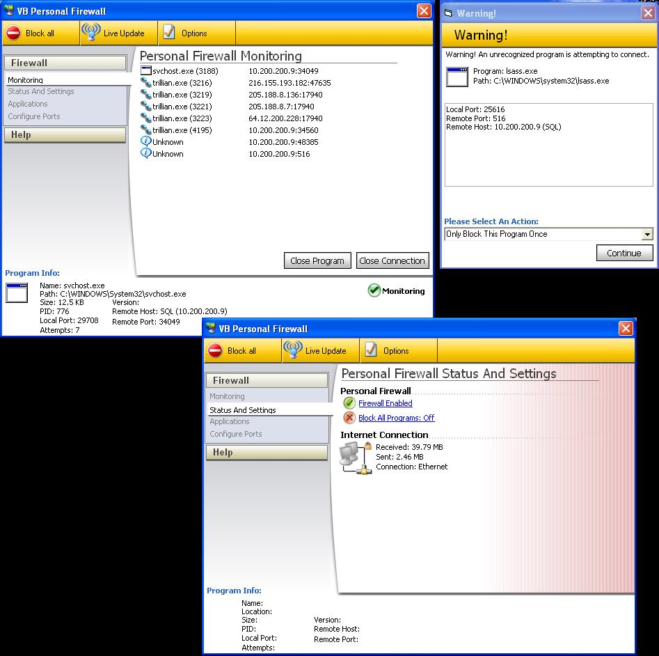



## VB Firewall

### Description

This is a little firewall i decided to build. i tried my best to repllicate its gui after the new NIS 2005.
 
### More Info
 

             |
---                |---
**Submitted On**   |2004-11-04 19:33:58
**By**             |[Eric Wolcott](https://github.com/Planet-Source-Code/PSCIndex/blob/master/ByAuthor/eric-wolcott.md)
**Level**          |Advanced
**User Rating**    |4.4 (35 globes from 8 users)
**Compatibility**  |VB 5\.0, VB 6\.0
**Category**       |[Internet/ HTML](https://github.com/Planet-Source-Code/PSCIndex/blob/master/ByCategory/internet-html__1-34.md)
**World**          |[Visual Basic](https://github.com/Planet-Source-Code/PSCIndex/blob/master/ByWorld/visual-basic.md)
**Archive File**   |[VB\_Firewal1814451142004\.zip](https://github.com/Planet-Source-Code/eric-wolcott-vb-firewall__1-57098/archive/master.zip)

